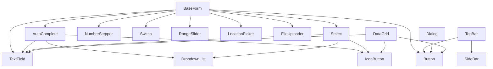

# 📦 Base Components Analysis

> Análisis detallado de los componentes base de Flow Store
> Última actualización: 25 de diciembre de 2025

---

## 📊 Tabla de Z-Index

| Capa | Z-Index | Componentes | Descripción |
|------|---------|-------------|-------------|
| Base/Background | `z-0` | Alert (fondo), TextField (input) | Capa base para contenido regular |
| Hidden/Negative | `-z-10` | Select (input validación oculto) | Elementos fuera del flujo visual |
| Sticky Headers | `z-10` | DataGrid (headers de columnas) | Contenido fijo durante scroll |
| Controls | `z-20` | AutoComplete (iconos), Select (iconos) | Controles flotantes de formularios |
| Fixed Navigation | `z-30` | TopBar (header principal) | Navegación fija superior |
| Overlay Backdrop | `z-40` | TopBar (overlay del sidebar) | Fondos de overlay |
| Modal/Dialog | `z-50` | Dialog, SideBar | Modales y paneles laterales |
| **Dropdowns (Portal)** | `z-9999` | DropdownList, Select dropdown, AutoComplete dropdown | **Menús desplegables via Portal (máxima prioridad)** |

> ⚠️ **Nota importante**: Los dropdowns de `Select` y `AutoComplete` ahora usan **React Portal** para renderizarse directamente en el `<body>`, escapando de cualquier contexto de stacking (como Dialogs con overflow). Esto garantiza que siempre se muestren por encima de cualquier otro contenido.

---

## 🗂️ Categorías de Componentes

### 🔘 Controles de Formulario (Form Controls)

| Componente | Z-Index | Descripción |
|------------|---------|-------------|
| **TextField** | `z-0` | Input versátil con soporte para texto, textarea, número, email, password, fecha, teléfono, RUT chileno y moneda |
| **AutoComplete** | `z-20` | Búsqueda con autocompletado y navegación por teclado |
| **Select** | `z-20`, `-z-10` | Dropdown de selección con variantes `default` y `minimal` |
| **NumberStepper** | - | Input numérico con botones de incremento/decremento |
| **Switch** | - | Toggle switch para valores booleanos |
| **RangeSlider** | - | Slider de doble thumb para rangos de valores |

---

### 📋 Composiciones de Formulario (Form Compositions)

| Componente | Ubicación | Descripción |
|------------|-----------|-------------|
| **CreateBaseForm** | `BaseForm/` | Genera formularios dinámicos para crear registros |
| **UpdateBaseForm** | `BaseForm/` | Formulario de edición con valores precargados |
| **DeleteBaseForm** | `BaseForm/` | Diálogo de confirmación de eliminación |

**Tipos de campo soportados:**
- `text`, `textarea`, `autocomplete`, `number`, `numberStepper`
- `email`, `password`, `date`, `switch`, `select`, `range`
- `location`, `dni`, `currency`, `image`, `video`, `avatar`

---

### 🖱️ Botones y Acciones (Buttons & Actions)

| Componente | Z-Index | Variantes | Tamaños |
|------------|---------|-----------|---------|
| **Button** | - | `primary`, `secondary`, `tertiary`, `contrast` | `small`, `medium`, `large` |
| **IconButton** | - | `primary`, `secondary`, `tertiary`, `error`, `contrast`, `success` | `xxs`, `xs`, `sm`, `md`, `lg`, custom |

---

### 🔽 Overlays y Modales (Overlays & Modals)

| Componente | Z-Index | Características |
|------------|---------|-----------------|
| **Dialog** | `z-50` (configurable) | Modal con backdrop, múltiples tamaños, scroll modes, ESC para cerrar |
| **DropdownList** | `z-60` | Contenedor genérico para listas desplegables |

**Tamaños de Dialog disponibles:**
- `xxs`, `xs`, `sm`, `md`, `lg`, `xl`, `custom`

---

### 🗂️ Visualización de Datos (Data Display)

| Componente | Z-Index | Descripción |
|------------|---------|-------------|
| **DataGrid** | `z-10` | Tabla de datos con ordenamiento, filtros, paginación y exportación a Excel |
| **Badge** | - | Etiquetas para estados o contadores |

**Variantes de Badge:**
- `default`, `success`, `warning`, `error`, `info`
- Versiones outlined para cada color

---

### 📢 Feedback

| Componente | Z-Index | Variantes |
|------------|---------|-----------|
| **Alert** | `z-0` | `success`, `warning`, `error`, `info` |
| **DotProgress** | - | Indicador de carga animado con puntos |

---

### 🧭 Navegación (Navigation)

| Componente | Z-Index | Descripción |
|------------|---------|-------------|
| **TopBar** | `z-30` (header), `z-40` (overlay) | Header principal con logo, título e integración de menú |
| **SideBar** | `z-50` | Menú lateral con items anidados y glassmorphism |

---

### 📁 Gestión de Archivos (File Management)

| Componente | Descripción | Límites |
|------------|-------------|---------|
| **MultimediaUploader** | Subida de múltiples archivos con preview | Imágenes: 10MB, Videos: 70MB |
| **MultimediaUpdater** | Actualización/reemplazo de archivos existentes | Avatar: 2MB |

---

### 🗺️ Mapas (Maps)

| Componente | Z-Index | Tecnología |
|------------|---------|------------|
| **LocationPicker** | `z-1` | Leaflet/OpenStreetMap |

---

## 🏗️ Arquitectura de Capas (Stacking Context)

```
┌─────────────────────────────────────────────────────────┐
│ z-9999 │ Dropdowns Portal (Select, AutoComplete)       │ ◄── Máxima prioridad (Portal)
├────────┼───────────────────────────────────────────────┤
│  z-60  │ Dropdowns legacy (sin portal)                 │
├────────┼───────────────────────────────────────────────┤
│  z-50  │ Modales (Dialog, SideBar)                     │
├────────┼───────────────────────────────────────────────┤
│  z-40  │ Overlays/Backdrops                            │
├────────┼───────────────────────────────────────────────┤
│  z-30  │ Navegación fija (TopBar)                      │
├────────┼───────────────────────────────────────────────┤
│  z-20  │ Controles flotantes (iconos de inputs)        │
├────────┼───────────────────────────────────────────────┤
│  z-10  │ Contenido sticky (headers de DataGrid)        │
├────────┼───────────────────────────────────────────────┤
│  z-0   │ Capa base (inputs, alerts, contenido)         │
├────────┼───────────────────────────────────────────────┤
│ -z-10  │ Elementos ocultos (inputs de validación)      │
└─────────────────────────────────────────────────────────┘
```

### 🚀 Solución Portal para Dropdowns

Los componentes `Select` y `AutoComplete` ahora utilizan **React Portal** (`createPortal`) para renderizar sus dropdowns directamente en el `<body>` del documento. Esto resuelve el problema común donde los dropdowns quedaban cortados dentro de contenedores con `overflow: hidden` o `overflow: auto` (como los Dialogs).

**Características del modo Portal:**
- Posición `fixed` calculada dinámicamente
- Z-index de `9999` para máxima prioridad
- Se reposiciona automáticamente en scroll y resize
- Detección inteligente de espacio disponible (drop-up/drop-down)

---

## 📝 Dependencias entre Componentes



---

## ⚠️ Notas Importantes

### Consideraciones de Z-Index

1. **Dropdowns con Portal**: Los dropdowns de `Select` y `AutoComplete` ahora usan `usePortal={true}` por defecto, lo que los renderiza con `z-index: 9999` directamente en el body. Esto asegura que **nunca queden cortados** dentro de Dialogs u otros contenedores con overflow.

2. **Dialog vs Dropdowns**: Dialog usa `z-50` por defecto. Con el modo portal, los dropdowns (`z-9999`) siempre se mostrarán por encima del Dialog sin importar el contexto.

3. **TopBar y SideBar**: TopBar usa `z-30`, el overlay usa `z-40`, y SideBar usa `z-50`. Esta jerarquía asegura el correcto apilamiento.

4. **Personalización de Dialog**: El z-index del Dialog es configurable mediante la prop `zIndex`.

### Clases CSS Globales

Las siguientes clases están definidas en archivos CSS globales:

| Clase | Ubicación | Z-Index | Descripción |
|-------|-----------|---------|-------------|
| `.dropdown-list` | `global.css` | 60 | Modo legacy (posición absolute) |
| `.dropdown-list-portal` | `global.css` | 9999 | Modo portal (posición fixed) |
| `.select-dropdown` | `Select/Select.css` | 60 | Legacy |
| `.range-*` | `RangeSlider/RangeSlider.css` | - | Estilos de slider |

### Props del DropdownList

| Prop | Tipo | Default | Descripción |
|------|------|---------|-------------|
| `usePortal` | `boolean` | `false` | Renderiza el dropdown en el body via Portal |
| `anchorRef` | `RefObject<HTMLElement>` | - | Referencia al elemento trigger para calcular posición |
| `dropUp` | `boolean` | `false` | Fuerza la apertura hacia arriba |

---

## 🔧 Resumen de Props Importantes

### Dialog

| Prop | Tipo | Default | Descripción |
|------|------|---------|-------------|
| `zIndex` | `string` | `'z-50'` | Clase de Tailwind para z-index |
| `size` | `string` | `'md'` | Tamaño del modal |
| `scroll` | `string` | `'body'` | Comportamiento de scroll |
| `blocking` | `boolean` | `false` | Previene cerrar el modal |

### TextField

| Prop | Tipo | Descripción |
|------|------|-------------|
| `type` | `string` | Tipo de input (text, textarea, number, dni, currency, etc.) |
| `variant` | `string` | Estilo visual (normal, contrast, autocomplete) |
| `startIcon` / `endIcon` | `string` | Iconos Material Symbols |

### DataGrid

| Prop | Tipo | Descripción |
|------|------|-------------|
| `columns` | `Column[]` | Definición de columnas |
| `rows` | `T[]` | Datos a mostrar |
| `sortable` | `boolean` | Habilita ordenamiento |
| `filterable` | `boolean` | Habilita filtros |
| `exportToExcel` | `boolean` | Habilita exportación |

---

> 📌 **Tip**: Para mantener consistencia visual, utiliza siempre los componentes base en lugar de crear elementos HTML nativos con estilos personalizados.
